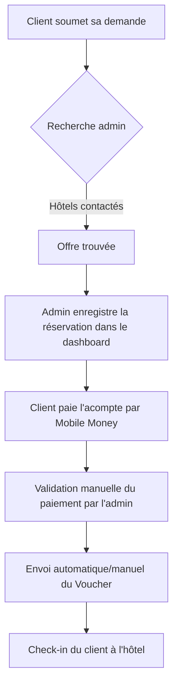

# Guide des Opérations Commerciales - CongoBooking

Ce guide décrit la procédure opérationnelle pour l'équipe qui gère la plateforme CongoBooking au quotidien.

## 📈 Flux Opérationnel Standard

### Étape 1 : Réception de la Demande
- Une notification ou une veille régulière sur l'espace admin (`/admin/demandes`) montre les nouvelles demandes.
- Les demandes ont le statut **Nouvelle demande**.

### Étape 2 : Négociation et Recherche hôtelière
- L'administrateur passe la demande en **Recherche en cours**.
- Il appelle les hôtels partenaires du quartier demandé en priorité, en favorisant ceux qui ont le meilleur **score de fiabilité**.
- Une fois la chambre confirmée par téléphone/WhatsApp, l'administrateur convient d'un prix final.

### Étape 3 : Création de la Réservation & Demande d'Acompte
- L'administrateur clique sur "Réserver" sur la demande.
- Il sélectionne l'hôtel, saisit le prix convenu et définit le montant de l'acompte requis.
- Un code de voucher unique (ex: `BZV-2605-A1B2C`) est généré.
- La demande passe au statut **Attente acompte**.
- L'administrateur contacte le client par téléphone ou WhatsApp pour lui communiquer les détails de paiement.

### Étape 4 : Validation du Paiement
- Dès que le client envoie l'acompte sur le numéro Mobile Money de l'agence, il fournit la référence de transaction.
- L'administrateur se rend sur `/admin/paiements`, clique sur **Confirmer** sur la transaction correspondante.
- Le statut de la réservation passe en **Acompte reçu** (payment_confirmed).

### Étape 5 : Check-in et Clôture
- Le client se présente à l'hôtel muni de son code voucher.
- L'hôtel confirme le check-in.
- L'administrateur valide le check-in sur `/admin/reservations` en passant le statut à **Check-in effectué**.
